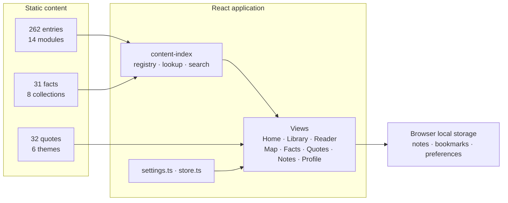
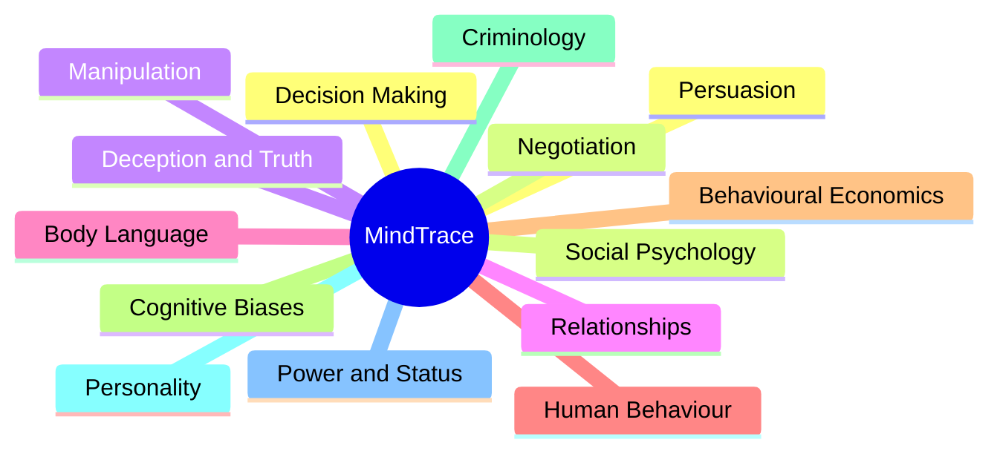
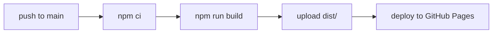

<div align="center">

<h1>
  <span style="color:#14120f;">Mind</span><span style="color:#b23a2a;">Trace</span>
</h1>

**Understand people. Understand yourself.**

A reading library for psychology, relationships and human behaviour —
**262** structured entries across **14** modules, with a research-backed facts
library, a curated quotes collection and an interactive concept map.

[](https://apsideslabs.github.io/mindtrace/)
[](LICENSE)
[](#tech-stack)

[](https://react.dev)
[](https://www.typescriptlang.org)
[](https://vite.dev)
[](https://tailwindcss.com)

[](#what-you-can-learn)
[](#what-you-can-learn)
[](#the-facts-library)
[](#quotes)

[Live site](https://apsideslabs.github.io/mindtrace/) ·
[Report a bug](https://github.com/apsideslabs/mindtrace/issues) ·
[Request a feature](https://github.com/apsideslabs/mindtrace/issues)

</div>

---

## Table of contents

- [What is MindTrace](#what-is-mindtrace)
- [What you can learn](#what-you-can-learn)
- [Features](#features)
- [Architecture](#architecture)
- [Module map](#module-map)
- [The facts library](#the-facts-library)
- [Quotes](#quotes)
- [Tech stack](#tech-stack)
- [Getting started](#getting-started)
- [Deployment](#deployment)
- [Project structure](#project-structure)
- [Responsible use](#responsible-use)
- [License](#license)

---

## What is MindTrace

MindTrace is a fully static reading library for psychology, relationships and
human behaviour. It runs entirely in the browser — **no account, no server, no
tracking** — and every note, bookmark and preference stays on your device.

Across the 262 entries sit **2,742 individual sections** of writing (an average
of 10.5 per entry), which is roughly **18 hours of reading** at the library's own
stated read times. The content is plain JSON, the app is React, and the whole
thing ships as static files to GitHub Pages.

| | |
| :--- | :--- |
| **Entries** | 262 across 14 modules |
| **Sections** | 2,742 (avg 10.5 per entry) |
| **Facts** | 31 sourced findings in 8 collections |
| **Quotes** | 32 from 24 authors, in 6 themes |
| **Reading time** | ~18 hours |
| **Hosting** | GitHub Pages — static, no backend |

## What you can learn

The library is organised into fourteen modules. Every entry runs to roughly ten
sections — typically *What It Is*, *Why It Works*, *How It Actually Appears*,
*Real Phrases*, *Warning Signs*, *Protection Strategy*, *Common Mistakes* and a
closing *Key Insight* — so you can read straight through or jump to what you need.

| Module | Entries | What it covers |
| :--- | ---: | :--- |
| **Persuasion** | 33 | The mechanisms of influence — reciprocity, scarcity, social proof, framing, pre-suasion. |
| **Negotiation** | 30 | Strategy and leverage — BATNA, ZOPA, first offers, concessions, tactical empathy, hardball tactics. |
| **Manipulation** | 20 | Coercive tactics and their warning signs — gaslighting, love bombing, DARVO, intermittent reinforcement. |
| **Relationships** | 20 | Attachment, communication, boundaries and what separates healthy connection from harmful. |
| **Body Language** | 20 | Non-verbal cues, micro-expressions, posture, baseline behaviour and cultural differences. |
| **Human Behaviour** | 18 | Everyday effects that shape how people act — halo effect, loss aversion, the bystander effect. |
| **Behavioural Economics** | 16 | Money and value perception — prospect theory, mental accounting, the pain of paying. |
| **Cognitive Biases** | 16 | Systematic errors in judgement — anchoring, hindsight, survivorship, the planning fallacy. |
| **Criminology** | 16 | Predatory behaviour — grooming, coercive control, the cycle of abuse, victim selection. |
| **Personality** | 16 | Traits and typologies — the Big Five, the dark triad, attachment styles, grit, locus of control. |
| **Power & Status** | 15 | Hierarchies and status — dominance versus prestige, gatekeeping, the Matthew effect. |
| **Decision Making** | 14 | How people choose — choice overload, decision fatigue, the decoy and default effects. |
| **Social Psychology** | 14 | Groups and influence — conformity, obedience, groupthink, deindividuation. |
| **Deception & Truth** | 14 | Interviewing and cues — the cluster principle, the Othello error, cognitive load. |

## Features

- **Library** — browse all 262 entries by module, filter by unread, read or saved, and search within a module.
- **Reader** — long-form entry with a contents sidebar, a reading-progress bar, related reading and previous / next navigation.
- **Key-line emphasis** — the key line of every section is underlined and the important points in warning and protection sections are highlighted. Switchable.
- **Notes & highlights** — select any passage to add a note; it is re-marked inline in your chosen colour and saved. Export everything to a single Markdown file.
- **Map** — an interactive graph of how entries connect, in three views — category map, concept web and relationship graph — exportable as a PNG.
- **Facts** — 31 sourced findings, each with an evidence rating and a cited reference, organised into collections.
- **Quotes** — 32 attributable quotes grouped into six themes.
- **Search** — a global overlay that searches entries and facts as you type.
- **Reading settings** — a floating panel for theme, accent colour, text size, page width, highlight colour, emphasis and focus mode.
- **Profile** — entries read, saved items, reading time and library progress, with a one-click clear of local data.

## Architecture

Everything is static. The content layer is a folder of JSON entries and typed
data files; the app reads them at build time and keeps all reader state in the
browser.



## Module map

The fourteen modules and what sits under each.



## The facts library

Short, sourced findings that each carry an evidence rating and a cited
reference — 31 findings across eight collections and four categories.

| Category | Collection | Findings |
| :--- | :--- | ---: |
| Psychology Facts | Brain & Cognition | 3 |
| Psychology Facts | Cognitive Biases | 5 |
| Psychology Facts | Decision Making | 5 |
| Psychology Facts | Emotion | 1 |
| Psychology Facts | Memory | 1 |
| Relationships, Love & Sex | Attachment & Attraction | 7 |
| Social & Human Behaviour | Social Influence | 4 |
| Crime & Dark Psychology | Deception & Manipulation | 5 |

Evidence ratings run from 3 to 5 on the product's own scale: 13 findings are
rated 5, 17 are rated 4 and one is rated 3. Every finding cites at least one
source.

## Quotes

32 quotes from 24 authors, grouped into six themes: Psychology (8), Philosophy
(9), Human Nature (6), Leadership (3), Success & Work (3) and Motivation &
Discipline (3) — from Carl Jung, Daniel Kahneman and Viktor Frankl to Marcus
Aurelius, Seneca and Sun Tzu.

## Tech stack

| Layer | Choice |
| :--- | :--- |
| Framework | React 19 |
| Language | TypeScript 5.8 |
| Build | Vite 6 |
| Styling | Tailwind CSS 4 |
| Animation | Motion |
| Concept map | React Flow + Dagre |
| Image export | html-to-image |
| Icons | lucide-react |
| Type | Fraunces (display) · Inter (body) |

**No backend, no API keys, no tracking.** Reading history, bookmarks, notes and
display preferences are stored in the browser's local storage; nothing leaves
the device.

## Getting started

**Prerequisites:** Node.js 20 or newer.

```bash
# install dependencies
npm install

# start the dev server
npm run dev

# production build to dist/
npm run build

# preview the production build
npm run preview

# type-check
npm run lint
```

## Deployment

Pushing to `main` builds the site and publishes it to GitHub Pages via the
workflow in [`.github/workflows/deploy.yml`](.github/workflows/deploy.yml).



## Project structure

```
mindtrace/
├── .github/workflows/deploy.yml   # build + deploy to GitHub Pages
├── public/                        # favicon, robots.txt, sitemap.xml
├── src/
│   ├── components/                # Home · Library · Reader · Map · Notes · Profile
│   ├── content/
│   │   ├── content-index.ts        # category registry, lookup and search
│   │   ├── quotes.ts               # 32 quotes across 6 themes
│   │   ├── facts/                  # 4 categories · 8 collections · 31 findings
│   │   └── <module>/               # 14 modules · 262 entry .json files
│   ├── facts/                      # fact browsing and reader views
│   ├── settings.ts                 # theme, accent, text size, page width, focus
│   ├── store.ts                    # local-storage reader state
│   └── App.tsx
├── index.html
└── package.json
```

## Responsible use

MindTrace is an educational resource. It teaches patterns and probabilities, not
certainty. It is **not** medical, legal or diagnostic advice, and it is not a
substitute for a qualified professional. Always read it alongside your own
judgement.

## License

Released under the [Apache-2.0 License](LICENSE).

<div align="center">
<sub>Built by <a href="https://github.com/apsideslabs">Apsides Labs</a> · <a href="https://apsideslabs.github.io/mindtrace/">apsideslabs.github.io/mindtrace</a></sub>
</div>
